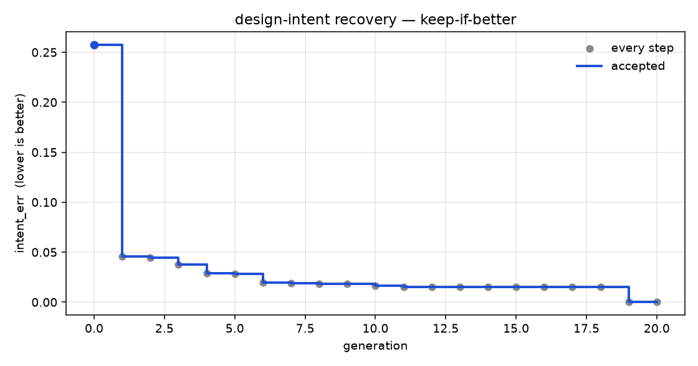

# autoregen

A [Karpathy autoresearch](https://github.com/karpathy/autoresearch)-style loop for **parametric CAD**.

Give an agent one observed solid and the **names** of the driving parameters (values withheld). The agent edits a reconstruction program. An immutable evaluator scores that program on the observed member **and** on held-out parameter vectors. If the score improved, keep the edit. If not, throw it away. Repeat.

You wake up to a log of experiments and a solver that recovered design intent.



**Grok 4.6 medium**, 20 generations, **12 accepted** recursive steps. `intent_err` 0.258 → 0.000. Grey dots are every experiment (including rejects). The blue step is the accepted frontier.

## Why this is the CAD analogue of autoresearch

Karpathy’s loop works because of four properties, not because of anything about LLM training:

1. One scalar, lower-is-better
2. Cheap enough to try something every few minutes
3. Immutable — the agent does not grade itself
4. Git as the ratchet — keep if better, else reset

A solid either regenerates or it doesn’t. Volumes, extents, and mass centroids are exact. That is a free, machine-checkable signal — the same role `val_bpb` plays in autoresearch.

The task is **design-intent recovery**, not “match this one STEP file.” Copying the observed bounding box looks fine on the part you were shown and falls over on the next size the customer orders.

## Three files

| File | Role |
|---|---|
| `prepare.py` | Immutable. Generates the synthetic set, scores solvers, runs the ratchet. |
| `solver.py` | **The only file the agent edits.** Task in → `build(**params)` source out. |
| `program.md` | Human-written research brief. The agent reads it; the agent does not edit it. |

`hidden_eval.py` holds the sealed family builders. `--workdir` copies only `solver.py`, `program.md`, and the visible tasks — the agent never gets the answer key in its cwd.

```
shape_err  = ⅓ volume + ⅓ bbox extents + ⅓ mass-centroid
intent_err = mean over tasks of (mean shape_err over observed + held-out members)
```

The centroid term is load-bearing: a centered hole and an offset hole have the same volume and the same bounding box. Only the mass centroid tells them apart. Keep if strictly lower. Equal or worse is a discard.

## A real 12-keep run (Grok 4.6 medium)

One hypothesized change per generation. Rejects stay in the log and are not the next start.

| gen | `intent_err` | | what it tried |
|---:|---:|:---:|---|
| 0 | 0.258 | keep | baseline: emit the observed box, ignore parameters |
| 1 | 0.046 | keep | bind `width` / `depth` / `height` (and radius) to the envelope |
| 2 | 0.045 | keep | centered through-hole when `hole_d` is the only extra |
| 3 | 0.038 | keep | tube: `inner_r` cuts the cylinder |
| 4 | 0.029 | keep | centered boss from `boss_d` / `boss_h` |
| 5 | 0.028 | keep | offset hole — `hole_x` / `hole_y` move the centroid |
| 6 | 0.020 | keep | offset boss — `boss_x` / `boss_y` |
| 7 | 0.019 | keep | counterbore from `cbore_d` / `cbore_h` |
| 8 | 0.018 | keep | fillet all edges when `fillet_r` is present |
| 9 | 0.018 | discard | chamfer *all* edges (wrong blend) |
| 10 | 0.016 | keep | through-slot from `slot_l` / `slot_w` |
| 11 | 0.015 | keep | two-hole pattern at `±pitch/2` |
| 12 | 0.015 | keep | chamfer *top* edges only (the discarded idea, repaired) |
| 19 | 0.000 | keep | extrude cylinders from z=0, not a centered primitive |

Raw log: [`examples/grok-4.6-medium.tsv`](examples/grok-4.6-medium.tsv).

Twelve families sit under opaque ids (`t_8f1a0c2b`, …). Parameter **names** are the intended hint. Family verbs are not in the path.

## Quick start

```bash
python3.13 -m venv .venv
source .venv/bin/activate
pip install -r requirements.txt

# Score the honest (mediocre) baseline twice — the number must match
python prepare.py generate
python prepare.py score
python prepare.py score

# Local dummy researcher — ≥10 accepted steps
python prepare.py loop --agent dummy --gens 15 --workdir runs/dummy

# Grok 4.6 medium
python prepare.py loop --agent grok --gens 20 --workdir runs/grok \
    --model grok-4.6 --effort medium
```

The loop prints the frontier `intent_err` and the path to `results.tsv`. `chart.png` in the workdir is the accepted frontier plus every discard.

## Ownership

- Agent edits `solver.py` only. Anything else is reverted before scoring.
- `data/hidden/` is sealed ground truth. The solver is not given those files.
- `results.tsv` is append-only and untracked. Rejects stay in the log.

## Tests

```bash
python -m pytest tests/ -q
```
