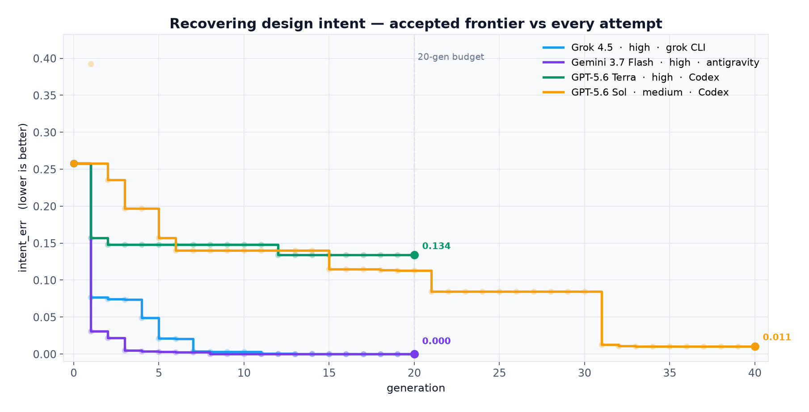
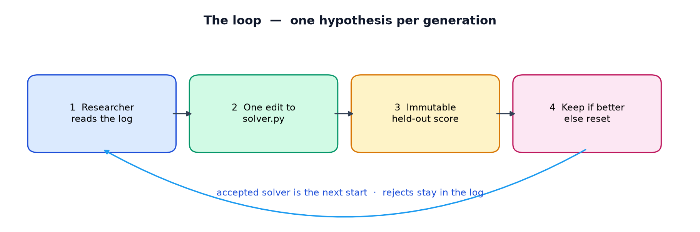
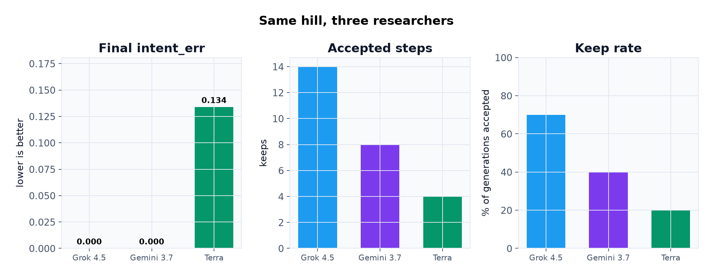
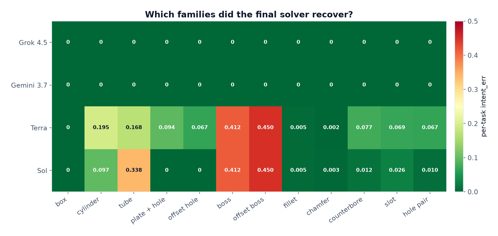
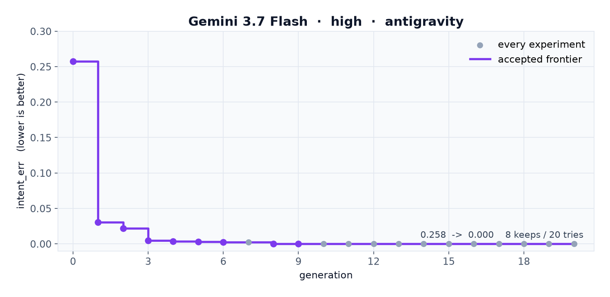
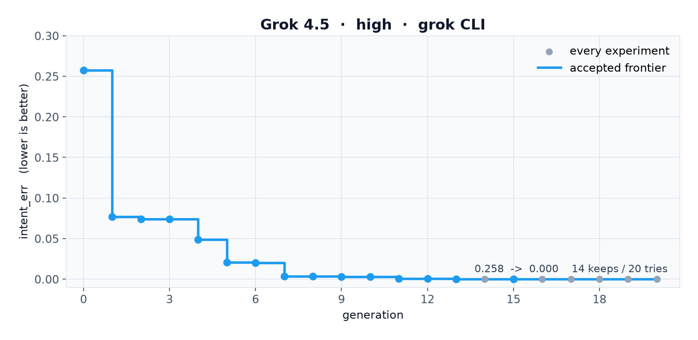
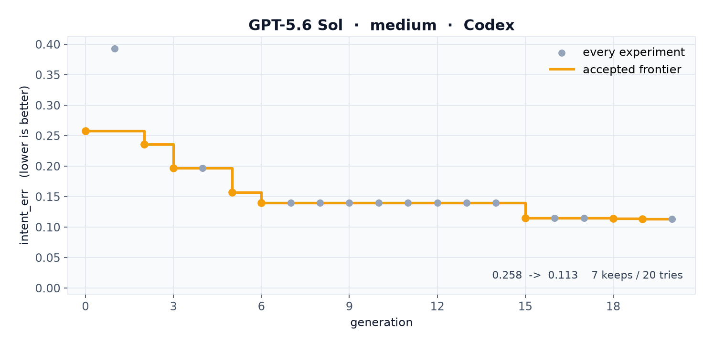
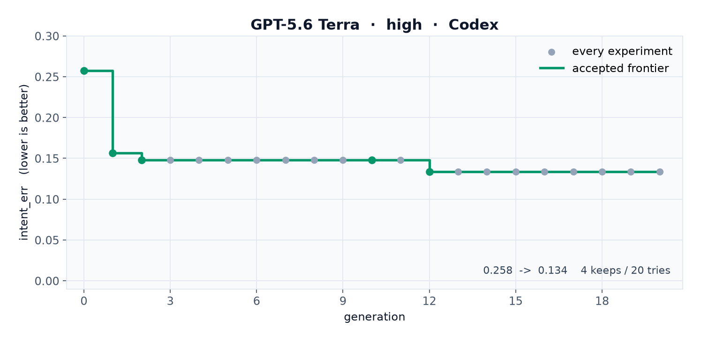

# autoregen

A [Karpathy autoresearch](https://github.com/karpathy/autoresearch)-style loop for **parametric CAD**.

Give a coding agent one observed solid and the **names** of the driving parameters. Values are withheld. The agent edits a reconstruction program. An immutable evaluator rebuilds the family at the observed member **and** at held-out sizes the agent never saw. If the score improved, keep the edit. If not, throw it away. Repeat.

The question is not “can you match this one STEP file?” It is “did you recover the design?”



Same starting solver. Same twelve families. Same 20-generation budget. Four researchers. Sol then got 20 more generations from its gen-19 frontier — the dashed line on the chart is that budget.

| Researcher | Harness | At gen 20 | Final | Keeps | Solved at |
|---|---|---:|---:|---:|---|
| **Grok 4.5** high | grok CLI | **0.000** | **0.000** | 14 | gen 15 |
| **Gemini 3.7 Flash** high | Antigravity (`agy`) | **0.000** | **0.000** | 8 | gen 9 |
| **GPT-5.6 Sol** medium | Codex | 0.113 | **0.011** | 11 / 40 | — |
| **GPT-5.6 Terra** high | Codex | 0.134 | 0.134 | 4 | — |

Gemini recovered the whole set in eight accepted steps. Grok got there too, with a longer staircase. At the shared 20-gen budget Sol was only a little ahead of Terra. The extra 20 is where Sol found the tube and the bosses — 0.113 → 0.011. The leftover is a slightly-wrong cylinder and a couple of unfinished hole families.

## The big picture

Karpathy’s loop works because of four properties, not because of anything about LLM training:

1. One scalar, lower-is-better
2. Cheap enough to try something every few minutes
3. Immutable — the agent does not grade itself
4. Git as the ratchet — keep if better, else reset

A CAD family has those four properties for free. Volumes, bounding-box extents, and mass centroids are exact. That is a machine-checkable signal — the same role `val_bpb` plays in autoresearch.

The trap the eval is built around: **copying the observed solid looks fine on the part you were shown and falls over on the next size the customer orders.** A centered hole and an offset hole have the same volume and the same bounding box. Only the mass centroid tells them apart. Shape-matching the one STEP file is not the task.

Twelve families sit under opaque ids (`t_8f1a0c2b`, …). Parameter **names** are the intended hint. Family verbs are not in the path.



You wake up to a log of experiments and a solver that either recovered design intent or honestly failed in public.

## The score

```
shape_err  = ⅓ |Δvolume| / volume
           + ⅓ mean |Δextent| / extent
           + ⅓ |Δcentroid| / bbox_diagonal

intent_err = mean over tasks of (mean shape_err over observed + held-out members)
```

`intent_err` is in `[0, 1]`. Lower is better. A crash, timeout, or invalid solid scores 1.0 for that member. Same solver scored twice yields the same number.

Keep if strictly lower. Equal or worse is a discard. Rejects stay in the log and are not the next start.

## The race

Four coding-agent configurations. One hypothesized change per generation. Grok, Gemini, and Terra stopped at 20. Sol was resumed for 20 more.



| | Grok 4.5 | Gemini 3.7 Flash | GPT-5.6 Sol | GPT-5.6 Terra |
|---|---:|---:|---:|---:|
| Start | 0.258 | 0.258 | 0.258 | 0.258 |
| At gen 20 | **0.000** | **0.000** | 0.113 | 0.134 |
| Final | **0.000** | **0.000** | **0.011** | 0.134 |
| Keeps | 14 | 8 | 11 | 4 |
| Gens | 20 | 20 | 40 | 20 |
| Effort | high | high | medium | high |

Raw logs: [`examples/grok-4.5-high.tsv`](examples/grok-4.5-high.tsv) · [`examples/gemini-3.7-flash-high.tsv`](examples/gemini-3.7-flash-high.tsv) · [`examples/gpt-5.6-sol-medium.tsv`](examples/gpt-5.6-sol-medium.tsv) · [`examples/gpt-5.6-terra-high.tsv`](examples/gpt-5.6-terra-high.tsv)

### What they actually recovered



Grok and Gemini finished at zero on every family. After the extra 20, Sol has the box, both holes, the tube, both bosses, and the slot. The leftover 0.011 is a slightly-wrong cylinder (0.097) plus thin misses on counterbore and the hole pair. Terra, at the original budget, still has the bosses almost untouched.

That is the eval doing its job. A solver can look plausible on the observed member and still fail the held-out sizes.

### How they climbed

**Gemini 3.7 Flash** took the biggest first step (0.258 → 0.031) by binding *both* the box envelope and the cylinder in one generation, then added holes, bosses, counterbores, patterns, fillets, slots, and a top-face chamfer. One discarded chamfer (all edges, wrong blend) was repaired two steps later. Done at generation 9.



**Grok 4.5** climbed one capability at a time, closer to the brief. Bind the box. Centered hole. Offset hole. Cylinder. Tube. Counterbore. Boss. Offset boss. Vertical fillet. Vertical chamfer. Slot. Two-hole pattern. All-edge fillet. Then the same chamfer trap Gemini hit — all edges, discarded — repaired as *top-face only*, and the score hit zero at generation 15.



**GPT-5.6 Sol** (medium), Codex harness. 40 generations, **11 accepted** steps. `intent_err` 0.258 → 0.011. At the shared 20-gen budget it was 0.113; the extra 20 is where the tube and bosses landed.



| gen | `intent_err` | | what it tried |
|---:|---:|:---:|---|
| 0 | 0.258 | keep | baseline: emit the observed box, ignore parameters |
| 1 | 0.392 | discard | bind length/width/height at once — score got *worse* |
| 2 | 0.235 | keep | bind `height` to Z |
| 3 | 0.197 | keep | bind `width` to X |
| 5 | 0.157 | keep | bind `depth` to Y |
| 6 | 0.140 | keep | cylinder from `radius` |
| 15 | 0.115 | keep | bind `thick` to plate Z |
| 18 | 0.114 | keep | centered through-hole from `hole_d` |
| 19 | 0.113 | keep | offset hole from `hole_x` / `hole_y` |
| 21 | 0.085 | keep | tube from `outer_r` / `inner_r` |
| 31 | 0.013 | keep | centered and offset bosses from `boss_d` / `boss_h` / `boss_x` / `boss_y` |
| 32 | 0.011 | keep | through-slot from `slot_l` / `slot_w` |
| 33 | 0.011 | keep | vertical-edge fillet from `fillet_r` |
| 34 | 0.011 | discard | chamfer as `chamfer_d` (the family is named `chamfer`) |
| 37 | 0.011 | discard | counterbore under the wrong aliases |

The leftover 0.011 is a slightly-wrong cylinder plus thin misses on counterbore and the two-hole pattern. Raw log: [`examples/gpt-5.6-sol-medium.tsv`](examples/gpt-5.6-sol-medium.tsv).

**GPT-5.6 Terra** (high) tried a different strategy: infer the family from the *observed solid’s topology*, then bind names. That recovered the box, a vertical cylinder, a chamfer, and a tube. Most of the other hypotheses (spheres, cones, tori, polygons, countersinks, pockets) were not on the hill, so they discarded. Sixteen rejects, four keeps, frontier stuck at 0.134.



A previous **Grok 4.6 medium** run on the same hill also reached 0.000, in 12 accepted steps. Log: [`examples/grok-4.6-medium.tsv`](examples/grok-4.6-medium.tsv).

## Three files

| File | Role |
|---|---|
| `prepare.py` | Immutable. Generates the synthetic set, scores solvers, runs the ratchet, launches harnesses. |
| `solver.py` | **The only file the agent edits.** Task in → `build(**params)` source out. |
| `program.md` | Human-written research brief. The agent reads it; the agent does not edit it. |

`hidden_eval.py` holds the sealed family builders. `--workdir` copies only `solver.py`, `program.md`, and the visible tasks — the agent never gets the answer key in its cwd.

## Quick start

```bash
python3.13 -m venv .venv
source .venv/bin/activate
pip install -r requirements.txt

# Score the honest (mediocre) baseline twice — the number must match
python prepare.py generate
python prepare.py score
python prepare.py score

# Local dummy researcher — ≥10 accepted steps
python prepare.py loop --agent dummy --gens 15 --workdir runs/dummy

# The four arms from this writeup
make grok45    # grok CLI    · grok-4.5              · high
make gemini    # antigravity · gemini-3.7-flash-high · high
make terra     # Codex       · gpt-5.6-terra         · high
make sol       # Codex       · gpt-5.6-sol           · medium
make sol-more  # same workdir, 20 more gens (--resume)

# Draw the race from examples/*.tsv
python plots.py
```

The loop prints the frontier `intent_err` and the path to `results.tsv`. `chart.png` in the workdir is that run’s accepted frontier plus every discard.

## Ownership

- Agent edits `solver.py` only. Anything else is reverted before scoring.
- `data/hidden/` is sealed ground truth. The solver is not given those files.
- `results.tsv` is append-only and untracked. Rejects stay in the log.

## Tests

```bash
python -m pytest tests/ -q
```
